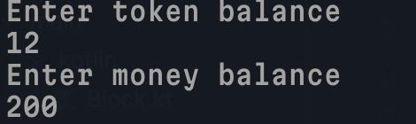
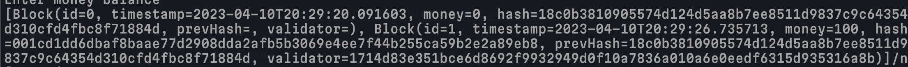

# Базовая реализация Proof-of-State блокчейна на Kotlin

## Для запуска понадобится gradle и команда
```gradlew run```

## Чтобы подключится к блокчейну можно использовать терминальную команду
```nc localhost 9002```

## Потом нужно будет ввести свой токен и свою условную валюту


## Позже программа напишет всем (всем кто решил учавствовать в добавлении своего токена) результат добавления
